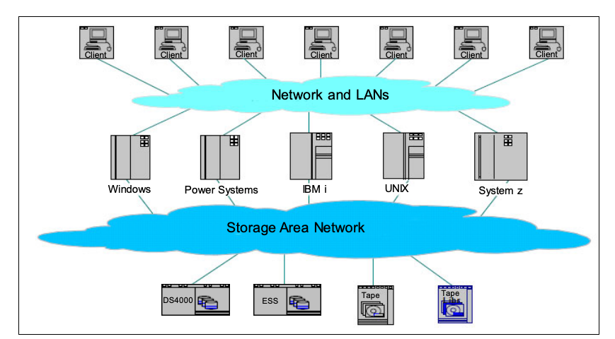
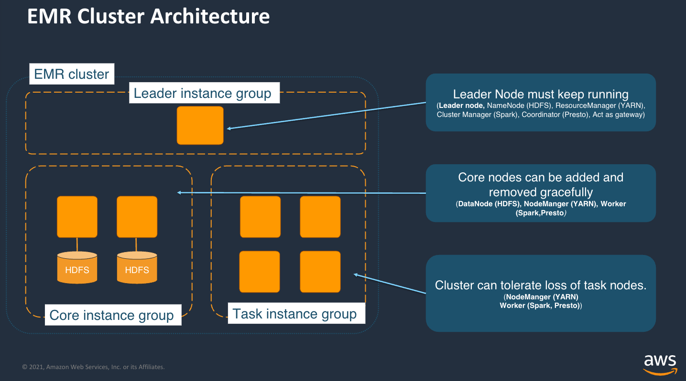
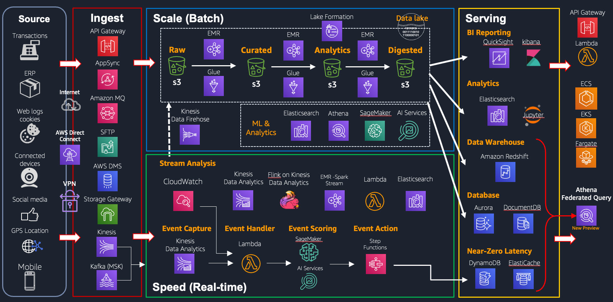

# 大数据存储笔记

## 大数据存储演进

### 大数据存储需求
1. PB/EB/ZB 海量数据存储，快速增长的数据量
2. 存储吞吐（可以多快读写存储）
3. 持久性 （数据丢失的风险）
4. 低存储成本

#### Google三篇论文以前的世界

##### 单机存储
计算机存储介质（例如：磁盘/磁带）通过RAID卡或者IDE/SATA接口插在主板上。通过RAID卡提供一定的数据持久性。存储容量和吞吐受限于单机硬件性能的限制。

单机存储局限：
无法满足大数据分析要求。

##### 商业SAN存储
计算机通过SAN连接到存储集群中，实现TB级别海量存储。商业SAN存储方案使用专有的存储传输访问协议（例如FC协议），实现存储吞吐/可靠性的大幅提升。

商业SAN存储对于互联网行业大数据分析场景的局限：

1. 大量使用专有协议的商业硬件，成本异常高
2. 实现多中心实时写入的架构复杂
3. 扩展性有限

##### 参考文档 
* [IBM红宝书](https://www.redbooks.ibm.com/redbooks/pdfs/sg245470.pdf)

#### Google三篇论文开启了大数据分析时代

##### Google三篇论文介绍
* [Google File System](https://static.googleusercontent.com/media/research.google.com/en//archive/gfs-sosp2003.pdf) (2003)

GFS是Google内部设计的一套专有的分布式文件系统，适用于大规模高吞吐分布式存储场景。Google的论文描述了GFS实现的方式。

* [MapReduce](https://research.google/pubs/mapreduce-simplified-data-processing-on-large-clusters/) (2004)

MapRedce是一种开发模式，用于处理和生成海量的数据集。Google的论文描述了MapReduce的实现原理。

* [Bigtable](https://static.googleusercontent.com/media/research.google.com/en//archive/bigtable-osdi06.pdf) (2006)

Bigtable是一套分布式的结构化数据存储系统（NoSQL数据库）。Bigtable基于GFS存储实现。Google的论文描述了bigtable的数据模型和实现原理。

#### Google三篇论文的开源实现

##### Hadoop
Apache Hadoop 是个由Apache基金会开发的分布式技术架构，用户可以在不了解分布式底层细节的情况下，开发分布式数据处理程序。

###### Hadoop的主要组件
1. Hadoop Distributed File System(HDFS): 一套满足高吞吐高数据持久性的分布式文件系统，基于GFS实现。
2. Hadoop YARN(Yet Another Resource Negotiator): 任务调度系统和集群资源管理系统。
3. Hadoop MapReduce: 基于YARN的并行计算系统，基于Google MapReduce开发模式实现。

###### Hadoop 架构

在自建数据中心场景中，运行Hadoop程序，数据会保存在HDFS集群存储中。运维人员需要保证：

1. Name Node的高可用；
2. 存储节点的硬件（包括磁盘使用率）工作正常；
3. 数据再平衡。

###### AWS EMR 架构 

* Master node(s)里运行HDFS的namenode和YARN
* Core instance group: 运行HDFS的数据节点及task
* Task insntance group: 运行tasks job。

EMR架构使用HDFS存储的特点：
1. HDFS运行在EBS卷上，对比对象存储成本较高。
2. 集群规模有局限（Data Node的数量）。
3. 集群生命周期结束，HDFS的数据即丢失。当没有计算任务时，仍需要保证Core Node集群运行。
4. 可用性有局限，因为EMR是单AZ部署，如果出现AZ级别故障，数据可能出现损坏。

综上，使用EMR HDFS最佳实践是只用来保存中间数据。最终数据应该通过EMRFS保存在对象存储（S3）中。

###### EMRFS
向上兼容HDFS接口，可以让hadoop/spark程序以hdfs访问的方式读写文件。EMRFS的后端存储是S3，并且提供list强一致，及read-after-write一致性能力。

行业内其他类似的实现： 
DBFS： Databricks File System，向上提供HDFS接口，数据保存在对象存储中。
OSS-HDFS：阿里云数据湖存储功能，兼容HDFS接口，数据保存在阿里OSS中。

###### 参考文档 
* [Wikipedia Apache Hadoop](https://en.wikipedia.org/wiki/Apache_Hadoop)
* [百度百科](https://baike.baidu.com/item/Hadoop/3526507)
* [How Map and Reduce operations](https://cwiki.apache.org/confluence/display/HADOOP2/HadoopMapReduce)
* [EMR架构描述](https://docs.aws.amazon.com/emr/latest/ManagementGuide/emr-overview-arch.html)
* [EMR访问存储的方式](https://docs.aws.amazon.com/emr/latest/ManagementGuide/emr-plan-file-systems.html)
* [DBFS](https://docs.databricks.com/en/dbfs/index.html)
* [阿里云OSS-HDFS](https://help.aliyun.com/zh/oss/user-guide/oss-hdfs-overview)

##### Apache HBase
Hbase是个由Apache基金会开发的亿万行级别NoSQL分布式数据库，数据模型基于Google的Bigtable论文实现。和Bigtable同样，HBase的存储也是基于HDFS（GFS的开源实现）。

EMR HBase支持把S3作为后端存储，可以在不需要HBase运行的时候关闭集群节省成本，以及避免EMR集群宕机后数据丢失。

###### 参考文档
* [HBase项目官网](https://hbase.apache.org/)
* [HBase On EMR](https://docs.aws.amazon.com/emr/latest/ReleaseGuide/emr-hbase.html)

##### Hive
Hive是基于Hadoop架构构建的一套数据仓库分析系统，它支持用SQL/UDF的方式查询和处理数据。对比Hadoop框架需要数据处理人员使用Java进行大数据处理任务，Hive降低的数据处理的开发门槛。

###### HCatalog
传统的Hadoop框架对于hdfs的读写都是直接设置inputPath和outPath ，然后以文件的形式访问数据，不涉及到结构化/半结构化的概念。即使如hive存储在hdfs的的结构化数据，外部系统访问也要程序员去了解具体的结构是如何存储的，然后才能对数据进行访问。

Hive组件HCatalog将结构化的hdfs数据定义schema和访问信息（db、table、partition），然后读和写的时候使用db、table、partition(对于无partition这个可以为空)这三部分信息来访问相应的表数据，屏蔽掉表底层InputFormat、OutFormat以及path信息，读写时可以使用类似数据库表的方式访问数据。

HCatalog支持通过REST API的方式对HCatalog进行库表源数据操作。

Glue Catalog是AWS提供的无服务集中式元数据仓库，兼容HCatalog API的访问模式。

###### 参考文档
* [HCatalog官网](https://cwiki.apache.org/confluence/display/Hive/HCatalog)
* [AWS EMR Apache HCatalog](https://docs.aws.amazon.com/emr/latest/ReleaseGuide/emr-hcatalog.html)
* [Glue Catalog](https://docs.aws.amazon.com/glue/latest/dg/catalog-and-crawler.html)
* [HCatalogVSGlueCatalog](https://lakefs.io/blog/metadata-management-hive-metastore-vs-aws-glue/)

#### Spark计算引擎
Hadoop框架非常复杂，主要问题如下：
1. 集群庞大难于运维管理；
2. API复杂，开发难度高，容错性脆弱；
3. 对于大规模批处理的MR任务，每个任务对的中间计算结果都要写入本地磁盘以供后续阶段操作。这种反复进行操作对磁盘 I/O消耗很大，因此非常耗时；
4. 对交互式SQL，流式处理和机器学习场景支持不佳；
5. 为了支持上门提到的新的数据分析需求，Hadoop框架衍生出了更多的关联项目(Apache Hive、Apache Storm、Apache Impala、Apache Giraph、Apache Drill、Apache Mahout),导致Hadoop生态复杂，初学者学习困难。

Spark项目源于加州大学伯克利分校，项目的核心目标是借鉴Hadoop MapReduce的思想，通过对MP过程的中间结果保存在内存的方式提升性能，以及提供更简单易用的API编程模型及统一的方式支持其他的工作负载。

##### Spark on EMR
EMR可以托管运行Spark计算任务。

##### Databricks
Spark开源项目维护者及Spark商业支持提供商。对Spark生态提供完整的技术支持，并提供专有的性能优化。

###### 参考文档
* [Spark FAQ](https://spark.apache.org/faq.html)
* [EMR Spark](https://docs.aws.amazon.com/emr/latest/ReleaseGuide/emr-spark.html)
* [databricks官网](https://www.databricks.com/)

## 对象存储S3
AWS的对象存储服务。客户端通过HTTP(s)的方式访问数据。

S3适用于数据分析存储的主要特性：
1. SaaS服务，无需运维，存储空间无限扩展，数据持久性高，11个9;
2. HTTP方式访问，通过并发访问方式提供高吞吐低延迟存储；
3. 成本低，存储分层，历史数据自动备份节约成本；
4. 安全，自带数据加密及IAM权限管理。

## 数据湖 （Datalake）

### 数据湖定义
* 中心化的数据仓库，保存所有的结构化/非结构化的数据，无论数据规模多大

### 数据湖主要概念
* 所有数据都在一个位置
* 支持不同的数据格式 - 结构化的/半结构化的/非结构化的/裸数据
* 提供读元数据仓库
* 基于低成本存储设计
* 计算存储解藕(存算分离)
* 支持数据保护及安全策略

### AWS数据湖的基础
S3

### 基于数据湖的AWS数据分析架构

###### 参考文档
* [官方白皮书](https://d1.awsstatic.com/AWS%20Cloud%20Storage/Unleashing-the-full-potential-of-your-data.pdf)

